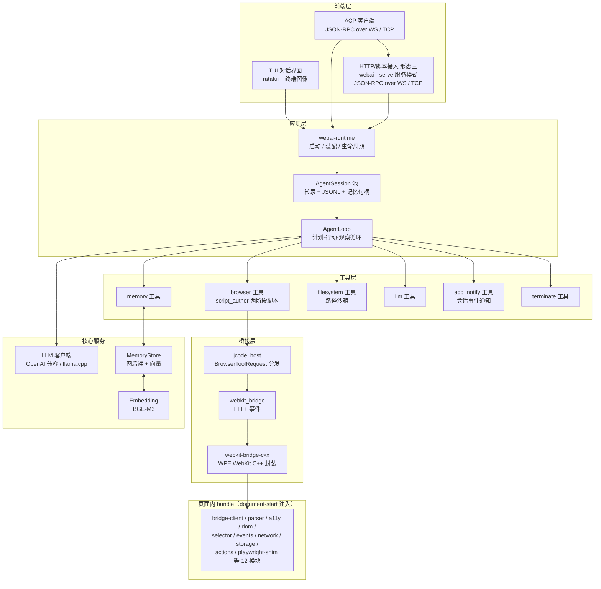
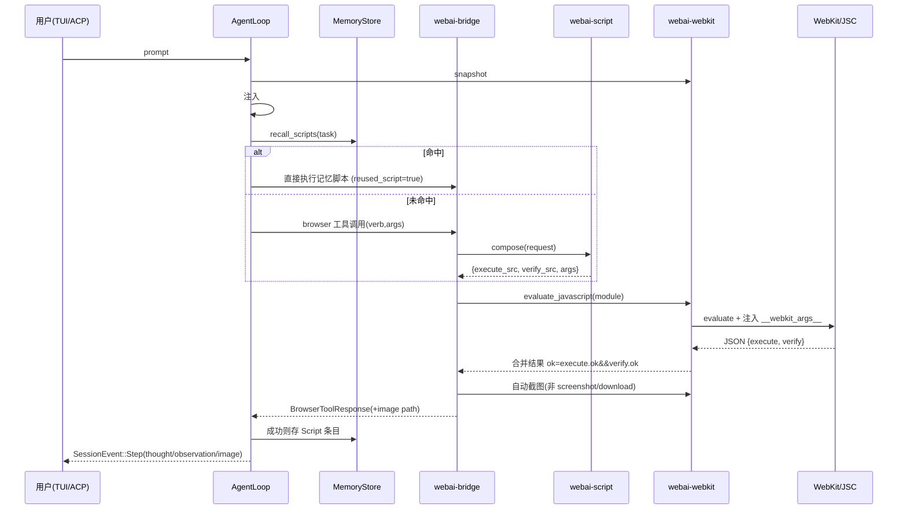

# webai-ng 架构设计说明书

> 版本：1.0（2026-08-30）
> 角色：架构设计 agent 产出
> 配套文档：`PRODUCT-DESIGN.md`（产品设计说明书，另行编写）
> 目标读者：负责从零落地 webai-ng 的工程师

## 1. 核心架构理念

本章是整个架构的纲领。以下五条定论继承自现有实现（`web-agent-rs` 约 22k 行 Rust、遗留 C++ `web-agent/`）的已验证经验，是全部后续章节（crate 划分、接口、数据流、并发模型）推导的前提。任何偏离这五条的设计变更必须以 ADR 形式记录并评审。

### 定论一：脚本驱动浏览器控制（script-driven browser control）

所有浏览器动作一律表达为 JavaScript，由 LLM 在运行时**编写或组合**，Rust 桥只负责把脚本注入 WebKit 并回收 JSON 结果。动词面与产品 FR-1 / §4.1 `BrowserVerb` 枚举逐项对应，共 13 个：

`navigate` / `click` / `fill` / `hover` / `drag` / `press_key` / `evaluate` / `screenshot` / `accessibility_tree` / `get_text` / `get_html` / `download` / `snapshot`

（完整形态以 §4.1 `BrowserVerb` 为准；network 拦截等能力是页面内 bundle 模块的构建块，不属于动词表。）

**Rust 侧不实现任何浏览器命令逻辑。**

- 理由：浏览器行为复杂且多变，命令式 Rust 实现会持续膨胀且难以覆盖长尾场景；脚本化把复杂度收敛到 JS 层，Rust 桥保持薄而稳定。
- 替代方案（已否决）：Rust 原生命令分发（如 CDP 风格命令表）。现有实现已验证其维护成本远高于收益。
- 后果：脚本质量依赖 LLM 与脚本记忆机制（见定论四），必须有结构化失败语义（execute/verify 两阶段，见定论二）作为兜底。

### 定论二：两阶段参数化脚本（two-phase, parameterised scripts）

每个动作动词生成 `execute_<verb>(args)` + `verify_<verb>(args)` 两个函数的模块。参数经 `window.__webkit_args__` 注入而非内联字面量。

- 效果 1：记忆下来的脚本模块可以**换参数复用**（同一脚本服务不同 URL / 不同选择器 / 不同输入值）。
- 效果 2：失败可归因——错误结构必须标注失败发生在 execute 阶段还是 verify 阶段，并携带 JS 异常原文，禁止 `unknown error`。
- 后果：`webai-script` crate 的输出必须是纯函数（动词 + 参数 → JS 模块文本），便于单测与 fuzz。

### 定论三：JavaScript 引擎唯一

JS 执行只发生在 WebKit 的 JavaScriptCore 内。Rust 侧不嵌第二个 JS 引擎。

- 理由：双引擎会带来语义漂移（DOM API、事件时序在不同引擎中行为不一致）与双份安全审计面。现有仓库中 vendored JS 运行时的路线已被证明是弯路。
- 后果：任何需要在页面外执行 JS 的场景（如 bundle 自检）也必须通过 WebKit 离屏上下文完成，而非引入 Node/QuickJS 等第二引擎。

### 定论四：脚本记忆与自修复

每次成功的浏览器调用将脚本以结构化条目（`task` / `verb` / `url` / `script`，tag `script:{verb}`）存入长期记忆；调度前先查 `recall_scripts` 复用；失败时做**一次**携带上下文的 LLM 修复调用。

- 修复调用的上下文固定包含：失败脚本 + 错误信息 + 至多 3 条相似脚本 + 浏览器状态快照 + 页面文本。
- 修复仅尝试一次；二次失败则把结构化错误返回给 AgentLoop 决策（换路径或向用户求助），避免无限修复循环。
- 可通过配置 `script_memory_enabled` 关闭（降级为每次直接生成）。

### 定论五：会话一等公民

每个 session（ACP `session_id` 或本地聊天）对应一个长生命周期 `AgentSession`，持有：

1. 会话转录（messages 历史）；
2. JSONL 追加式持久化——写后即 flush，崩溃最多损失最后一条截断记录，恢复时跳过截断行续跑（落盘路径 `~/.webai/sessions/`）；**归属唯一：JSONL 会话日志由 `webai-memory` 提供（§4.4），`AgentSession` 只持有写入句柄，不自行实现 appender**；
3. 可选的跨会话共享记忆句柄（向量 + 图双通道 MemoryStore）。

- 理由：会话是产品层三形态（形态一 TUI / 形态二 ACP / 形态三 `--serve` 服务模式，见 PRODUCT-DESIGN §3）统一的抽象单位，把它做成一等对象后，三种前端形态复用同一套会话生命周期与恢复语义。
- 后果：`AgentSession` 的状态机（新建 / 恢复 / 暂停 / 关闭）必须在 `webai-agent` crate 中显式建模，不允许散落在前端代码里。

## 2. 顶层架构图

系统自上而下分为六层：前端层 → 应用层 → 工具层 → 桥接层 → 核心服务，以及运行在 WebKit 页面内的 bundle。**编译期依赖单向向下**（核心服务除外，被应用层与工具层共享调用）；图中出现的双向箭头表示运行期调用/数据流（如 AgentLoop 调用 LLM、MemoryStore 互相读写），LLM/MemoryStore 等被调方不反向依赖调用方，故不构成依赖方向上的回边。



### 各层职责摘要

| 层 | 组成 | 职责边界 |
|---|---|---|
| 前端层 | 形态一 TUI（ratatui）、形态二 ACP 客户端、形态三 `webai --serve` 服务模式（复用 webai-acp 服务端） | 用户交互与会话协议；不包含业务逻辑；三形态共享 runtime 入口 |
| 应用层 | runtime、AgentSession 池、AgentLoop | 启动装配、会话生命周期、计划-行动-观察循环 |
| 工具层 | browser / memory / filesystem / llm / acp_notify / terminate | AgentLoop 可调用的工具集；browser 工具产出两阶段脚本；acp_notify 推送会话事件 |
| 桥接层 | jcode_host、webkit_bridge、webkit-bridge-cxx | 脚本注入、事件回收、截图 / 下载 / 快照；唯一含 C++ 的位置在 webkit-bridge-cxx |
| 核心服务 | LLM 客户端、MemoryStore、Embedding | 被应用层与工具层共享；无上游依赖 |
| 页面内 bundle | document-start 注入的 12 模块 | DOM 解析、可访问性树、事件、网络拦截、playwright-shim 兼容层 |

### 关键边界约束

1. 前端层只经由 runtime 的公共接口进入，禁止直接触碰工具层或桥接层。
2. 桥接层对上只暴露 `BrowserToolRequest` 分发语义，不感知"动词"业务含义（定论一）。
3. 核心服务不依赖任何上层；MemoryStore 同时承载脚本记忆（定论四）与跨会话知识。
4. 页面内 bundle 与 Rust 的唯一通信契约是脚本注入 + `window.__webkit_args__` 参数注入 + JSON 结果回收（定论二）。

> 后续章节：§3 cargo workspace 划分与分层依赖规则、§4 各 crate 职责与关键接口、§5 关键数据流、§6 并发模型、§7 错误处理、§8-12 测试策略与构建依赖，由对应任务分别产出。

## 3. 工作区（cargo workspace）划分与分层依赖规则

### 3.1 目录结构

```
webai-ng/
├── Cargo.toml            # workspace，resolver = "2"，统一版本表（workspace.dependencies 集中管理）
├── crates/
│   ├── webai-protocol/   # 纯类型：Request/Response/错误码/事件（零依赖，serde only）
│   ├── webai-config/     # TOML 配置加载（五文件 schema）
│   ├── webai-llm/        # LLM 客户端（OpenAI 兼容 + 本地 llama.cpp server）
│   ├── webai-memory/     # MemoryStore：图后端 + 向量 + JSONL 会话日志
│   ├── webai-embedding/  # 嵌入接口 + BGE-M3 适配
│   ├── webai-script/     # script_author：动词 -> 两阶段 JS 模板（纯函数，可 fuzz）
│   ├── webai-bridge/     # jcode_host 等价物：工具调用分发、截图、下载、快照
│   ├── webai-webkit/     # WebkitBridge：FFI、load 事件、document-start 注入
│   ├── webai-bridge-cxx/ # #[cxx::bridge] 绑定到 cog/libwpe 封装 C++（唯一含 C++ 的 crate）
│   ├── webai-agent/      # AgentLoop、AgentSession、plan、script_memory、history_summariser
│   ├── webai-acp/        # ACP JSON-RPC over WS / 行分隔 TCP 服务端
│   └── webai-tui/        # ratatui + crossterm 前端，含终端图像（Kitty/iTerm2/Sixel）
└── bins/
    └── webai/            # 主二进制：默认起 TUI；--serve 起 ACP；--headless 无界面
```

### 3.2 分层依赖规则（强制）

依赖只能沿以下偏序自左向右（`{a, b}` 表示并列、无相互依赖；箭头 `x < y` 表示 y 依赖 x）：

```
protocol < config < {llm, embedding, script}    # 三个独立能力 crate 平行、互不依赖
embedding < memory                              # memory 的向量检索依赖 embedding 生成向量
{script, webkit} < bridge                       # bridge 组合 script 与 webkit（二者间无依赖边）
{llm, memory, bridge} < agent                   # agent 直接依赖 llm/memory（规划/修复/脚本记忆），经工具层调 bridge
agent < {acp, tui} < bins/webai                 # 前端共享 agent 公共接口；webai 二进制装配全部
```

覆盖说明：`agent` 对 `embedding` 的依赖经 `memory` 间接达成（不含直接调用边）；`acp` / `tui` 之间无相互依赖，二者都可被 `bins/webai` 组合（同一进程内 TUI 与 ACP 服务共存，见 §4.10 共享 registry）。

含义与检查手段：

| 规则 | 说明 |
|---|---|
| `webai-protocol` 零依赖 | 只依赖 serde；所有 crate 依赖它共享 wire 类型，杜绝类型漂移 |
| `{llm, embedding, script}` 互不依赖 | 三个能力 crate 平行；`memory` 是唯一依赖 `embedding` 的上层（向量检索），组合发生在上层（agent / bridge） |
| `agent` 对核心服务依赖摊平 | `agent < llm`（规划/修复/summariser）、`agent < memory`（脚本记忆/会话日志）；`embedding` 经 `memory` 间接 |
| `webkit` 不依赖 `script` | 桥只认 JS 文本，不感知动词语义（定论一）；`bridge` 负责组合 script + webkit |
| `agent` 不被任何前端依赖反向引用 | acp / tui 只依赖 agent 的公共接口 |
| C++ 隔离 | 只有 `webai-bridge-cxx` 含 C++；`legacy_cpp` 是 **opt-in feature，default features 不含它**；`cargo build --no-default-features` 必须可编译可测试 |

强制执行：CI 中用 cargo-deny（ban 多版本、限制依赖来源）+ 自写分层检查脚本（解析 crate graph，断言上述偏序），违规即构建失败。

### 3.3 workspace 级约定

- `resolver = "2"`，全部公共依赖版本集中在根 `Cargo.toml` 的 `[workspace.dependencies]`，crate 内只写 `workspace = true`。
- tokio features 在 workspace 统一声明（rt-multi-thread/macros/time/net/io-util/sync/process/io-std/fs/signal），禁止各 crate 自行裁剪导致 feature 合并意外。
- `bins/webai` 是唯一二进制入口，负责装配（读 config → 构建服务 → 起 TUI/ACP）；装配逻辑尽量下沉到 `webai-agent` 的 runtime 模块，二进制保持薄。

## 4. 各 crate 职责与关键接口

### 4.1 webai-protocol
- `Request` / `Response`（Bridge 协议）、`BrowserToolRequest { verb, args }`、`BrowserVerb`（Navigate/Click/Fill/Hover/Drag/PressKey/Evaluate/Screenshot/AccessibilityTree/GetText/GetHtml/Download/Snapshot）、错误码 `codes`。
- `SessionEvent`：`Step / Done / Error`（含 `image`、`reused_script` 标记）。
- 零逻辑、零 IO；所有其他 crate 依赖它以共享 wire 类型。

### 4.2 webai-config
五文件 TOML schema，**文件名与键名与产品文档（PRODUCT-DESIGN §7.1）逐项一致**，存放于配置目录（默认 `~/.webai/config/`，`WEBAI_CONFIG` 环境变量指向该目录）：

| 文件 | 职责 | 关键键 | 缺失影响 |
|---|---|---|---|
| `agent.toml` | agent 行为 | `max_steps`、`duplicate_threshold`、`auto_plan_on_multi_step`、`script_memory_enabled` | fail-fast（无默认护栏时拒绝启动） |
| `llm.toml` | LLM provider | 多 profile（`[profile.xxx]`：endpoint / model / api_key / timeout） | fail-fast，按名选 profile |
| `embd.toml` | 向量 embedding | 模型端点、维度 | 降级：仅图通道或无记忆运行 |
| `mem.toml` | 记忆储存 | 向量+图后端地址、数据库路径 | 降级：无记忆运行，主流程不受影响 |
| `vec.toml` | 向量检索 | HNSW 参数（M/ef/维度）、索引路径 | 降级：同 embd |

加载失败 = 启动失败（fail fast，限于 `agent.toml` / `llm.toml`）；**缺少 `embd.toml` / `mem.toml` / `vec.toml` 时优雅降级**为无记忆模式。

### 4.3 webai-llm
- `LlmClient::from_default_location()`；profile 到端点的映射；支持 OpenAI 兼容 HTTP（dashscope 等）与 llama.cpp 本地 server。
- 流式接口：`chat_stream(messages) -> Stream<Delta>`，供 TUI/ACP 实时输出。
- 多模态消息（含 image base64），供"看图操作浏览器"链路。

### 4.4 webai-memory
- `SharedMemoryStore`：图后端（Kuzu）+ 向量检索（HNSW）抽象。
- 会话日志：`~/.webai/sessions/<session_id>.jsonl`，`record_user_prompt / record_step / record_finished / record_error / close`，每次 write+flush。**JSONL 会话日志的归属唯一确定在 webai-memory**：AgentSession 只持有其写入句柄（§1 定论五 / §4.9），不做第二套 appender。恢复算法：`recovery_from_persisted_step` 跳过最后一条可能截断的行。
- 脚本记忆条目（`MemoryWriteKind::Script`）：字段 `task/verb/url/script`，标签 `script:{verb}`、`session:{id}`；检索接口 `recall_scripts(task)`。

### 4.5 webai-script（script_author 的独立化）
- 纯函数 `compose(request: &BrowserToolRequest) -> Result<ScriptModule>`。
- `ScriptModule { execute_src, verify_src, args }`；驱动 IIFE 返回 `{execute, verify, args}`。
- 词表：`execute_<verb>(args)` 读 `window.__webkit_args__`。
- Screenshot/Download/Snapshot 走单脚本 + 直通 verify（现状语义保留）。
- Download 特例：页面脚本只发 `needs_rust_download` 信号，真实下载由 Rust 侧 reqwest 完成。**文件名推断优先级与产品 FR-4 一致**：`args.filename` → `Content-Disposition` → URL 尾段 → 均不可得时由 LLM 按任务上下文生成有语义文件名（回退结果同样经过路径安全校验）；防路径穿越；重名加 `-N` 后缀。
- 全 crate 禁止 IO，测试 = 模板快照 + 参数注入 + 错误路径。

### 4.6 webai-webkit（WebkitBridge）
- 持有 `*mut WebkitView`（经 cxx crate），`Mutex` 串行化所有视图访问。
- `open(url)` / `evaluate_javascript(src, timeout_ms)` / `wait_for_load` / `inject_user_script`（document-start）/ `screenshot() -> PNG`。
- FFI trampoline 接收 `WEBKIT_LOAD_FINISHED -> bridge.page.load` 通知，更新 `last_load_uri` 并唤醒 `oneshot` 订阅者。
- **BUNDLE_SCRIPT_ORDER**（顺序敏感，必须保持）：`bridge-client.js`（首，安装 `window.__webkitBridge`）→ `parser/index.js` → `accessibility/index.js` → `dom.js` → `selector.js` → `events.js` → `network.js` → `storage.js` → `actions/{navigate,history,interact,extract,screenshot,composite}.js` → `legacy/playwright-shim.js`（末）。这些脚本安装 `WebkitAiDom / WebkitAiSelector / WebkitAiActions` 等构建块，动词脚本在其上组合。**新版本必须把页面侧构建块作为一等资产迁移**（建议移到 `page-bundle/` 独立目录并加 TS 类型与单测）。
- 无 FFI 环境（开发机）返回结构化 `CogLaunch` 错误，测试用 canned response 注入路径覆盖 dispatch 全链路。

### 4.7 webai-bridge-cxx
- 唯一允许包含 C++ 的 crate：cxx bridge 到 cog/WPEBackend-fdo 封装。`legacy_cpp` 是 opt-in feature，**default features 不包含它**（默认构建 Rust-only stub，可编译可测试）。
- feature `legacy_cpp` 之外不链接任何系统 WebKit；CI 有 `--no-default-features` 构建保证 Rust-only 可编译可测试。

### 4.8 webai-bridge（jcode_host 等价）
- `dispatch(Request) -> Response`（Bridge 协议入口），内部 `handle_tool_call(BrowserToolRequest) -> BrowserToolResponse`。
- 职责：调 `webai-script::compose` → `webkit.evaluate` → 合并 `execute`/`verify` 两阶段 payload，`ok = execute.ok && verify.ok`（verify 失败进入重生成路径）。
- **每次成功且非 screenshot/download 的操作后自动截图**，路径附在响应上，经 `ToolOutput.images → AgentStep.image → ChatMessage.image` 管道送入 TUI 与模型。截图失败不回滚本轮操作，但**必须产出结构化截图警告**（`error.code` + 人读原因 + 占位符标记），随 `SessionEvent::Step` 透出并在 TUI 呈现占位符+原因，禁止静默吞掉（对齐 FR-2 验收：每步要么有截图记录，要么有明确占位符+原因）。
- `parse_probe_response` 解析 snapshot：`location.href/title/readyState/正文片段`。
- 下载路由（见 4.5）在此实现：按 FR-4 优先级推断文件名，LLM 语义文件名回退与路径穿越防护在本层落地。

### 4.9 webai-agent
- `AgentLoop`：plan → act → observe 循环。
  - **自动规划**：提示含 ≥2 个浏览器动词、多步连接词（然后/再/and then）或长搜索汇总类请求时，注入一次幂等的 `# Plan required` 指令，强制先 `create_plan`（`LoopConfig::auto_plan_on_multi_step`，默认开）。
  - **每回合浏览器状态块**：非平凡回合先取 `browser.snapshot`，以 `# Current browser state` markdown 块注入上下文，让模型按真实 DOM 写脚本。
  - **脚本记忆复用**：调度前 `recall_scripts`，命中同动词则直接执行并标记 `reused_script: true`；失败则一次 LLM 修复（上下文见 §1 定论四）。
  - 守卫：`max_steps`（默认 30，超限产出结构化 `max_steps_exceeded` 事件）、`duplicate_threshold`（默认 2，相同观察即判卡死）。
  - `history_summariser`：长会话压缩。
- `AgentSession`：转录（`Mutex<Vec<ChatMessage>>`）、`Arc<AgentLoop>`、JSONL 写入句柄（复用 webai-memory 会话日志组件，见 §4.4）、可选 `Arc<SharedMemoryStore>`。
- 工具注册表：`Tool` trait + 六个工具：`browser` / `memory` / `filesystem` / `llm` / `acp_notify` / `terminate`（与 §2 工具层图一致）。文件工具必须有路径沙箱（沿用现有 `fs_bridge` 的校验逻辑）；`terminate` 供 AgentLoop 主动结束会话。

### 4.10 webai-acp
- JSON-RPC over WebSocket / 行分隔 TCP；方法面与现有 ACP 协议兼容。
- `AcpSessionRegistry`：`Mutex<HashMap<session_id, Arc<AgentSession>>>`，`session/prompt` 与 `session/close` 串行化；与 TUI 共享同一 registry，保证本地与远程观察一致。

### 4.11 webai-tui
- `session.rs`：后台服务，持 `Arc<AgentSession>`，mpsc 流出 `SessionEvent`。
- `app.rs`：ratatui 前端；按键：Enter 发送、↑↓ 滚动、PgUp/PgDn 翻页、Esc 清空输入（空时退出）、Ctrl+C 退出。
- 图像渲染：base64 PNG 在 ingest 时**解码一次**持久化到临时文件，仅对进入视口的可见步派发终端图像帧（Kitty/iTerm2/Sixel，否则占位符），退出时清理临时文件。

## 5. 关键数据流

### 5.1 一次浏览器工具调用（端到端）



### 5.2 失败修复路径

execute 或 verify 任一失败 → 收集 `{失败脚本, 错误(含 JS 异常原文), ≤3 条相似记忆脚本, memory recall 块, 近期步骤, 浏览器状态快照, 页面文本}` → 一次 LLM 修复调用 → 重执行 → 成功则入库。仍失败则作为观察反馈给主循环（`result.execute.error` / `result.verify.error` 结构化透出，禁止吞成 `unknown error`）。

### 5.3 崩溃恢复

启动时扫描 `~/.webai/sessions/*.jsonl` → 对目标 session 逐行解析，最后一行若非法 JSON 则丢弃 → 重建转录 → 从最后完整 step 续跑。

## 6. 并发与线程模型

- tokio 多线程 runtime（workspace 统一 features：rt-multi-thread/macros/time/net/io-util/sync/process/io-std/fs/signal）。
- **WebKit view 单线程亲和**：所有 FFI 调用经同一 `Mutex` 串行；load 事件用 oneshot 广播给异步等待者。**不允许**在 tokio worker 上直接阻塞 FFI，用 `spawn_blocking` 或专用桥线程。
- 会话间天然并行（每 session 独立 AgentLoop 步进）；内存后端内部自同步。
- 定时器/节流：TUI 渲染 tick 50ms；图像帧仅视口可见步、每次进入视口派发一次。

## 7. 错误处理

- `thiserror` 分层错误：`WebkitError`（CogLaunch/Timeout/ScriptError…）、`BrowserToolError`（缺参数等）、`LoopError`（max_steps_exceeded、duplicate_observation）。
- 所有跨层错误必须带结构化 `error.code` + 人读 detail；stub/FFI 缺失场景要能诊断（这是现有实现特别补过的点，不要倒退）。
- LLM 失败：有限次退避重试；记忆后端失败：降级为无记忆并打日志，不致命。

## 8. 配置示例（沿用 schema）

```toml
# agent.toml
max_steps = 30
duplicate_threshold = 2
auto_plan_on_multi_step = true
script_memory_enabled = true

# llm.toml
[profile.cloud]
endpoint = "https://api.dashscope.com/v1"
model = "deepseek-v4-flash"
timeout = 120

[profile.local]
endpoint = "http://127.0.0.1:8080"
model = "llama3"

# mem.toml
backend = "kuzu"
path = "~/.webai/memory/"
```

## 9. 测试策略（分层金字塔）

将现有 366+ 测试的经验固化为分层金字塔，自下而上：

1. **纯函数层**：script_author 模板快照、参数注入、动词覆盖、下载文件名/穿越防护单测。
2. **协议层**：Request/Response 序列化往返、错误码。
3. **桥层（无 FFI）**：canned response 注入覆盖 dispatch 全路径；snapshot probe 解析；PNG 占位图签名校验。
4. **host 集成**：进程内 HTTP server 验证 download（fetch+保存、服务端命名、穿越、坏 URL）。
5. **agent 循环**：脚本记忆复用/修复回归（现 `script_memory_loop_tests`）、自动规划触发词表、卡死守卫。
6. **会话持久化**：JSONL 截断恢复 fuzz。
7. **端到端（有 WebKit 的机器）**：`docs/browser-operation-test-cases.md` 用例矩阵 + `spec-coverage.md` 覆盖审计。

原则：下层不依赖上层；有 FFI 的测试只在专用 CI job 跑，本地 `cargo test` 全绿不要求系统 WebKit。

## 10. 构建与系统依赖

- Rust 1.87+，edition 2021；release：opt-level 3 + LTO + strip。
- 系统库（仅 linking 真桥时需要）：libwpe 1.16.x、WPEBackend-fdo 1.16.x、cog 0.19.x、WPE WebKit ≥2.50（自编译：`cmake -DCMAKE_BUILD_TYPE=Release -DUSE_LIBBACKTRACE=OFF -DPORT=WPE -G Ninja && ninja`）、OpenSSL 3、llama.cpp server（本地 LLM 时）。
- `cargo build --release` 必须**不**要求任何系统 WebKit（stub 构建可测试）；feature `legacy_cpp` 才拉起 C++ 过渡构建。
- 日志：tracing；环境 `G_MESSAGES_DEBUG=all` 开 WebKit 侧日志。
- 打包：单二进制 + `page-bundle/`（document-start 脚本）随二进制嵌入（`include_str!` 或 build.rs 打包），保证部署无外部脚本依赖。

## 11. 迁移与共存（兼容性）

- 旧 C++ `web-agent/` 在过渡窗口保留但排除出 workspace。**非 breaking**：ACP 协议方法面与 HTTP 路由（`GET /api/agents`、`POST /api/agents/{id}/tasks`）保持不变，调用方无感切换。
- 遗留 C++ 中的有价值资产：hnsw、tokenizer、BPE、kuzu 图 schema、playwright-shim.js——按需 port，不做整树迁移。

## 12. 里程碑建议（落地顺序）

1. **M1 骨架**：workspace + protocol + config + stub 构建绿、CI。
2. **M2 桥**：webkit-bridge-cxx + webai-webkit + document-start bundle 迁移，真机 navigate/evaluate/snapshot 打通。
3. **M3 脚本**：webai-script 两阶段模板 + webai-bridge 分发 + 自动截图 + download。
4. **M4 智能**：llm/memory/embedding + AgentLoop（自动规划、状态块、守卫）+ 脚本记忆与修复。
5. **M5 界面**：TUI（含图像）+ ACP 服务 + 崩溃恢复。
6. **M6 打磨**：端到端测试矩阵、打包嵌入、性能（脚本缓存、截图节流）。
